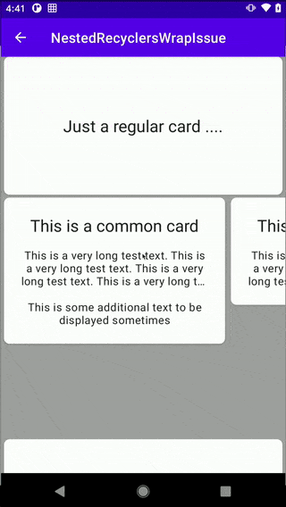

# Nested RecyclerViews Height Wrapping Issue

This repo showcases what seems to be a misbehavior of `RecyclerView` and `LinearLayoutManager` when two `RecyclerView` are nested together.

---

**Problem**

A **vertically** oriented `RecyclerView` containing two `ViewHolder` types: 
- one is a simple `CardView`.
- the other contains a **horizontally** oriented `RecyclerView` that works as a carousel with two different types of `ViewHolder` that vary in height.

My, *probably wrong*, assumption was that if the items in the nested `RecyclerView` and the `RecyclerView` itself were set to `wrap_content` the list would adjust its height and allow the nested items to take the height they need. 

What I actually found out was that the `RecyclerView` only seems to take into account the height of the first few type of `ViewHolder` in the list causing parts of the UI for other types being cut off. If the taller `ViewHolder` is in the beginning of the list this happens intermitently and sometimes the height is readjusted during scroll. **This behaviour does not happen at all if the list has only one type of `ViewHolder`, in this case adjusting its height properly.**

My wild guess is that this somehow relates to the [`AutoMeasure`](https://developer.android.com/reference/androidx/recyclerview/widget/RecyclerView.LayoutManager#isAutoMeasureEnabled()) feature. A possibly related reported bug is [RecyclerView cannot size itself based on the measured dimensions of its children](https://issuetracker.google.com/issues/37001674).

Looking through some very only StackOverflow questions I bumped into this [answer](https://stackoverflow.com/a/27616854) which I adjusted and created `WrappingLinearLayoutManager` which goes through the items in the `Recycler` and take their height into consideration when setting the `RecyclerView` height.

Here are some screenshots of what I believe to be the misbehaviour and how it should look like:

|Item Being Cut|Expected Behaviour (here using `WrappingLinearLayoutManager`)|
|------|------|
|||

